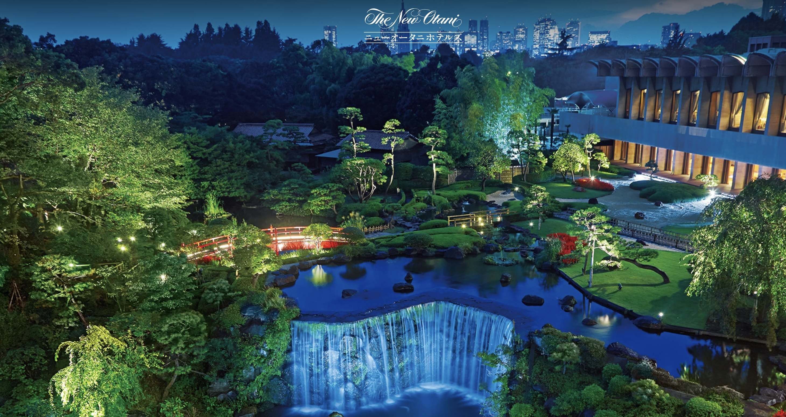

  
  <h1 style="margin: 0; font-size: 2.2rem; text-transform: uppercase; letter-spacing: 1px; color: var(--accent-color);">Welcome to SNAB 2025</h1>

The **2025 Workshop on Statistical Network Analysis and Beyond (SNAB 2025)** will take place on **June 2-4, 2025** at the renowned [Hotel New Otani](https://www.newotani.co.jp/en/tokyo/) in **Tokyo, Japan**.

{: style="border-radius: 10px; max-width: 100%; margin: auto; display: block;" }

---

## About the Conference

SNAB 2025 is a **three-day workshop** bringing together experts in **network science** and related fields. The conference serves as a platform for sharing cutting-edge research and fostering collaboration.

### Topics Include:
- Statistical network modeling 
- Tensor analysis and modeling
- Deep learning
- Transfer learning and multi-task learning
- Text analysis in network structures
- Applications in social, biological, and public health

---

## Organizers

<section class="section">
  <ul class="organizer-list">
    
    
      
      <li>
        
        

          <h3><a href="https://yangfengstat.github.io/https://www.stat.cmu.edu/~jiashun/https://qingfeng-liu.github.io/index1.htmlhttps://sites.google.com/view/maggiexniu/https://dept.stat.lsa.umich.edu/~jizhu/">{{ parts[0] }}</a></h3>
          
{{ parts[1] }}

        

      </li>
    
  </ul>
</section>

---

## Past SNAB Workshops

- [**SNAB 2024**](https://sites.google.com/view/snab2024/) - Bahamas  
- [**SNAB 2023**](https://www.snab2023.org/) - Anchorage, Alaska  
- [**SNAB 2022**](assets/pdf/SNAB2022 Workshop Brochure.pdf) - New York  
- [**SNAB 2021**](https://dept.stat.lsa.umich.edu/~jizhu/snab2021/) - Virtual  

---

## Sponsors

We are grateful to our sponsors for their support of SNAB 2025:

{: style="border-radius: 10px; max-width: 20%; margin: 20px auto; display: block;" }

---

We look forward to seeing you at **SNAB 2025** in Tokyo!
